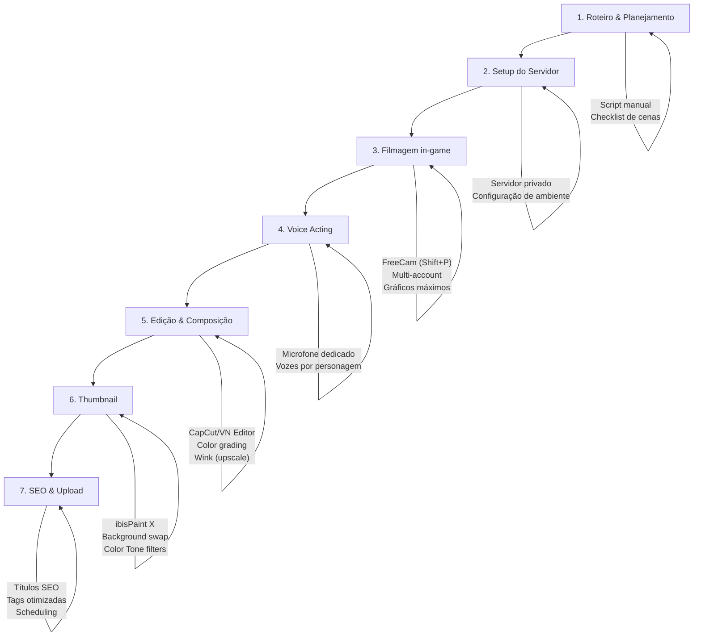

# 🔬 ANÁLISE COMPETITIVA: Canal @PinkMoonYouTube

## Resumo Executivo

> **DESCOBERTA CRÍTICA:** O canal @PinkMoonYouTube **NÃO é um canal de animação gerada por IA**. É um canal de **Roblox roleplay** (Berry Avenue) com ~962K subscribers, baseado nos EUA, focado em storytelling voice-acted dentro do jogo Roblox. Isso muda completamente a natureza da análise — em vez de engenharia reversa de ferramentas de AI, a análise se torna uma **comparação de modelos de produção** e identificação de **oportunidades estratégicas** que o THIAGERA pode explorar no mercado infantil/familiar com AI animation genuína.

> [!IMPORTANT]
> Este canal opera num modelo fundamentalmente diferente do THIAGERA. A principal lição é sobre **estratégia de conteúdo e engagement**, não sobre ferramentas de IA.

---

## 1. 📊 OVERVIEW DO CANAL

| Métrica | Dados |
|:---|:---|
| **Nome** | Pink Moon |
| **Handle** | @PinkMoonYouTube |
| **URL** | https://www.youtube.com/@PinkMoonYouTube |
| **Subscribers** | ~962,000 (Mai 2026) |
| **Views totais** | Centenas de milhões (estimativa 300-500M+) |
| **Data de criação** | Novembro 2020 |
| **Primeiro vídeo** | Dezembro 2020 |
| **País de origem** | Estados Unidos 🇺🇸 |
| **Idioma** | Inglês (EN) |
| **Tipo de conteúdo** | Roblox Berry Avenue Voiced Roleplay |
| **Público-alvo** | Crianças e pré-adolescentes (6-14 anos), predominantemente feminino |
| **Frequência de upload** | Regular (2-4 vídeos/semana + lives) |
| **Formatos** | Long-form RP (15-30 min), Shorts, Lives |

### Vídeos Mais Populares

| Vídeo | Views |
|:---|:---|
| MOVING DAY ROAD TRIP! BIG FAMILY ARRIVES AT OUR NEW HOUSE *VOICED* | 3.8M |
| TODDLERS FIRST PLAYDATE WITH NEW NEIGHBORS AND MOMS HANGOUT *VOICED* | 2.5M |
| FIRST DAY OF SPRING BREAK AFTER SCHOOL ROUTINE WITH MY KIDS *VOICED* | 2.1M |

### Canais Similares (Concorrentes Diretos)
- **Peachyylexi** — Berry Avenue & Bloxburg voiced RPs
- **iistarxy** — Berry Avenue voiced RPs, escola e família
- **Little Legs Scarlett** — Berry Avenue family roleplays com voice acting

---

## 2. 🎬 ANÁLISE TÉCNICA DE PRODUÇÃO

> [!NOTE]
> Este canal **NÃO utiliza AI video generation**. Os visuais são **captura de tela do Roblox** (gameplay gravado), não animação gerada por IA.

### Método de Produção Visual

| Aspecto | Detalhes |
|:---|:---|
| **Engine Visual** | Roblox (Berry Avenue) — motor de jogo, não AI |
| **Captura de vídeo** | OBS Studio ou gravação de tela nativa (MacOS/Windows) |
| **Câmera** | FreeCam (Shift+P no Roblox) para shots cinematográficos |
| **Resolução** | 1080p (definida pelas settings do Roblox + recording) |
| **Framerate** | 30-60fps (limitado pelo motor do Roblox) |
| **Ambientação** | Servidores privados com controle de clima/horário do dia |
| **Avatares** | Customização de avatares Roblox (roupas, corpo, animações) |
| **Animações** | Emotes nativos do Roblox + animações custom do marketplace |

### Técnicas de Filmagem Identificadas
1. **FreeCam cinematográfico** — câmera lenta e suave (Shift para slow movement)
2. **Multi-account** — uma conta controla a câmera, outra age na cena
3. **Interface limpa** — remove HUD, nomes, prompts de interação
4. **Gráficos máximos** — qualidade do Roblox no máximo
5. **Controle de ambiente** — pausa no tempo/clima para consistência de cena

### Qualidade Visual

| Critério | Nível | Nota |
|:---|:---|:---|
| Fluidez de movimento | ⭐⭐⭐ | Limitada pelo motor do Roblox |
| Consistência visual | ⭐⭐⭐⭐ | Alta - avatares configurados cuidadosamente |
| Variedade de cenários | ⭐⭐⭐⭐ | Berry Avenue tem muitos locais |
| Cinematografia | ⭐⭐⭐⭐ | FreeCam bem utilizado |
| Resolução/Fidelidade | ⭐⭐⭐ | Limitada pela engine do Roblox |

---

## 3. 🎭 CONSISTÊNCIA DE PERSONAGEM

### Como Mantêm Consistência

| Técnica | Implementação |
|:---|:---|
| **Avatares fixos** | Mesmas roupas/aparência mantidas ao longo da série |
| **"Berry Universe"** | Universo narrativo conectado entre episódios |
| **Character Bible** | Personagens recorrentes com identidades visuais fixas |
| **Roblox wardrobe** | O próprio sistema de inventário do Roblox garante consistência |

### Nível de Consistência: ⭐⭐⭐⭐⭐ (MUITO ALTO)

> [!TIP]
> A consistência é praticamente **perfeita** porque os personagens são avatares Roblox salvos — não há variação generativa. Esta é uma **vantagem natural do modelo baseado em jogo** vs. AI generation, onde consistência de personagem é um dos maiores desafios.

### Implicação para THIAGERA
O Roblox resolve consistência de personagem "de graça" — é um problema que simplesmente não existe para eles. Para o THIAGERA, precisamos investir em Subject Binding (Kling 3.0), SOUL ID (Higgsfield), ou LoRA customizados para competir neste aspecto.

---

## 4. 🔊 ANÁLISE DE ÁUDIO

### Voice Acting

| Aspecto | Detalhes |
|:---|:---|
| **Tipo** | Voice acting HUMANO (a criadora faz as vozes) |
| **Estilo** | Vozes diferenciadas por personagem (mãe, filhos, vizinhos) |
| **Qualidade** | Boa — microfone dedicado, sem eco/ruído |
| **TTS/AI?** | **NÃO** — 100% voz humana |
| **Lip-sync** | **NÃO** — avatares Roblox não fazem lip-sync por padrão |

### Música e Efeitos Sonoros

| Aspecto | Detalhes |
|:---|:---|
| **BGM** | Músicas stock/royalty-free de fundo |
| **SFX** | Básicos — sons do jogo + alguns adicionados na edição |
| **Sound Design** | Simples — foco no voice acting, não em sound design elaborado |

### Produção de Áudio — Avaliação

| Critério | Nível |
|:---|:---|
| Naturalidade das vozes | ⭐⭐⭐⭐⭐ (humano real) |
| Variedade de personagens | ⭐⭐⭐⭐ |
| Lip-sync | ⭐ (inexistente) |
| Sound design | ⭐⭐ |
| Trilha sonora | ⭐⭐⭐ |

---

## 5. ⚙️ PIPELINE DE PRODUÇÃO ESTIMADO

### Pipeline Step-by-Step Reconstruído

### Software Utilizado (Estimativa)

| Fase | Ferramenta | Custo Estimado |
|:---|:---|:---|
| Gravação | OBS Studio | Grátis |
| Gameplay | Roblox (Berry Avenue) | Grátis + Private Server (~$2-5/mês) |
| Edição de vídeo | CapCut / VN Editor | Grátis (com premium opcional ~$8/mês) |
| Upscale de qualidade | Wink App | Grátis (com premium) |
| Thumbnails | ibisPaint X | Grátis (com ads) |
| Filtros de cor | Color Tone App | Grátis |
| Voice acting | Microfone dedicado | Investimento único $50-200 |

### Estimativas de Produção

| Métrica | Estimativa |
|:---|:---|
| **Tempo por vídeo (15-30 min)** | 4-8 horas total |
| **Tempo de filmagem** | 1-3 horas |
| **Tempo de edição** | 2-4 horas |
| **Tempo de voice acting** | 1-2 horas |
| **Custo mensal de produção** | $10-50 (praticamente zero — ferramentas grátis) |
| **Equipamento necessário** | PC/Mac + microfone + internet |

> [!IMPORTANT]
> **Custo de produção quase ZERO.** O modelo Roblox roleplay tem uma das menores barreiras de entrada do YouTube. Isso é a antítese do modelo THIAGERA, que depende de APIs pagas de AI.

---

## 6. 📈 ESTRATÉGIA DE YOUTUBE

### Thumbnails

| Aspecto | Estratégia |
|:---|:---|
| **Estilo** | "Preppy aesthetic" — soft, dreamy, colorido |
| **Técnica** | Background removal + Pinterest backdrops + overlay decorativo |
| **Ferramentas** | ibisPaint X, Wink, Color Tone |
| **Elementos** | Avatares em poses expressivas, cores pastéis, borders/frames |
| **Drop shadows** | Sim — efeito 3D nos personagens |
| **Texto** | Mínimo a moderado, cores coordenadas |
| **Estilo geral** | Lifestyle graphic > screenshot de jogo |

### SEO & Títulos

| Padrão | Exemplo |
|:---|:---|
| **ALL CAPS** | "MOVING DAY ROAD TRIP!" |
| **Asteriscos para destaque** | "*VOICED* BERRY AVENUE" |
| **Keywords de nicho** | "Berry Avenue", "Voiced", "RP" |
| **Palavras emocionais** | "FIRST DAY", "NEW HOUSE", "BIG FAMILY" |
| **Contexto familiar** | "WITH MY KIDS", "TODDLER", "MORNING ROUTINE" |

### Engagement Strategy

| Tática | Implementação |
|:---|:---|
| **Community building** | Convida viewers para jogar no servidor |
| **CTAs** | Inscrever, ativar sininho, virar membro |
| **Serialização** | "Berry Universe" — narrativa contínua entre episódios |
| **Lives** | Streams regulares para engagement direto |
| **Resposta a comentários** | Ativa — hearts e respostas frequentes |
| **Channel membership** | Perks exclusivos para membros pagos |

### Frequência e Formato

| Formato | Frequência | Duração |
|:---|:---|:---|
| Long-form RP | 2-3x/semana | 15-30 min |
| Shorts | Irregular | 15-60 seg |
| Lives | 1-2x/semana | 1-3 horas |

---

## 7. 📊 TABELA COMPARATIVA: Pink Moon vs THIAGERA

| Critério | Pink Moon | THIAGERA (Projetado) | Vencedor |
|:---|:---|:---|:---|
| **Custo de produção** | ~$10-50/mês | $200-2000/mês (APIs AI) | 🏆 Pink Moon |
| **Consistência de personagem** | Perfeita (avatares Roblox) | Desafiante (AI generativa) | 🏆 Pink Moon |
| **Qualidade visual** | Limitada (Roblox engine) | Alta (AI state-of-art) | 🏆 THIAGERA |
| **Originalidade visual** | Genérica (estilo Roblox) | Única (estilo customizável) | 🏆 THIAGERA |
| **Voice acting** | Humano (natural, emocional) | TTS/AI (ElevenLabs) | 🏆 Pink Moon |
| **Lip-sync** | Inexistente | Possível (Higgsfield/SadTalker) | 🏆 THIAGERA |
| **Sound design** | Básico | Avançado (Stable Audio, AudioCraft) | 🏆 THIAGERA |
| **Escalabilidade** | Limitada (manual) | Alta (automatizável) | 🏆 THIAGERA |
| **Barreira de entrada** | Muito baixa | Alta | 🏆 Pink Moon |
| **SEO/Engagement** | Excelente | A definir | 🏆 Pink Moon |
| **Público-alvo** | EN (EUA) | PT-BR (Brasil) | Empate (mercados diferentes) |
| **Storytelling** | Serializado, community-driven | Episódico, narrativa original | Empate |
| **Diferenciação** | Personalidade da criadora | Tecnologia visual | Empate |

---

## 8. 🎯 ENGENHARIA REVERSA PARA THIAGERA

### ✅ O Que Aprender com Pink Moon

#### 1. Serialização Narrativa ("Berry Universe")
A estratégia mais poderosa de Pink Moon é o **universo narrativo conectado**. Cada vídeo é parte de uma saga maior, incentivando binge-watching e retorno.

**Ação THIAGERA:**
- [ ] Criar um "THIAGERA Universe" — mundo consistente com personagens recorrentes
- [ ] Desenvolver arcos narrativos multi-episódio (temporadas)
- [ ] Criar "family trees" e relationship maps dos personagens

#### 2. Voice Acting com Personalidade
As vozes humanas de Pink Moon criam conexão emocional imediata com o público infantil.

**Ação THIAGERA:**
- [ ] Investir em vozes expressivas no ElevenLabs (não usar vozes genéricas)
- [ ] Criar "voice profiles" únicos por personagem (tom, ritmo, catchphrases)
- [ ] Considerar contratar voice actors PT-BR para vozes-base do voice cloning
- [ ] Testar Bark para efeitos vocais (risadas, choro, surpresa)

#### 3. Thumbnails como "Lifestyle Graphics"
As thumbnails de Pink Moon parecem posters de lifestyle, não screenshots de jogo.

**Ação THIAGERA:**
- [ ] Gerar thumbnails com personagens AI em poses expressivas
- [ ] Usar backgrounds estilizados (não frames do vídeo)
- [ ] Aplicar estilo "poster de filme animado" em vez de screenshot
- [ ] Testar A/B com thumbnails estilo Pixar vs. estilo anime

#### 4. Community Engagement Ativo
Pink Moon trata o canal como uma comunidade, não só um repositório de vídeos.

**Ação THIAGERA:**
- [ ] Responder comentários ativamente (hearts + respostas)
- [ ] Criar polls e community posts perguntando o que os viewers querem ver
- [ ] Desenvolver membership com conteúdo exclusivo (behind-the-scenes do pipeline AI)
- [ ] Lives mostrando o processo de criação com AI (diferencial MASSIVO)

#### 5. Frequência de Upload Consistente
2-4 vídeos/semana + lives mostra presença constante.

**Ação THIAGERA:**
- [ ] Definir calendário fixo (mín. 2 vídeos/semana + Shorts diários)
- [ ] Usar pipeline automatizado para manter cadência
- [ ] Criar "content buckets": episódios longos, Shorts, behind-the-scenes

---

### 🚀 GAPS E OPORTUNIDADES (THIAGERA vs Pink Moon)

#### Gap 1: Mercado PT-BR
Pink Moon opera 100% em inglês. O mercado de animação infantil PT-BR com qualidade visual de IA é **virtualmente inexplorado** com conteúdo de alta qualidade.

> [!TIP]
> **OPORTUNIDADE GIGANTE:** Não existe um "Pink Moon brasileiro" com AI animation. O THIAGERA pode ser o primeiro.

#### Gap 2: Qualidade Visual
Roblox tem limitações visuais inerentes. AI-generated animation pode produzir visuais comparáveis a estúdios profissionais (Pixar, Illumination).

**Diferencial:** Enquanto Pink Moon está limitada ao estilo blocky/cartoonish do Roblox, THIAGERA pode criar mundos visualmente deslumbrantes com Kling 3.0, Runway Gen-4.5 e Flux.

#### Gap 3: Lip-Sync
Pink Moon **não tem lip-sync** — os avatares Roblox falam mas não movem a boca. THIAGERA pode ter lip-sync automático via Higgsfield SOUL ID ou SadTalker.

#### Gap 4: Sound Design Imersivo
Pink Moon usa áudio básico. THIAGERA pode criar experiências sonoras ricas com:
- Trilhas originais via Stable Audio 3.0 / Suno
- SFX via AudioCraft (AudioGen)
- Ambientação sonora por cena

#### Gap 5: Escalabilidade com IA
Pink Moon precisa filmar manualmente cada cena. THIAGERA pode gerar centenas de shots por hora via APIs, permitindo volume de produção impossível manualmente.

---

### 💰 Estimativa de Custo para Igualar/Superar

| Aspecto | Pink Moon (custo) | THIAGERA (custo p/ superar) |
|:---|:---|:---|
| Qualidade visual | $0 (Roblox grátis) | $500-1500/mês (APIs Kling/Runway) |
| Voice acting | $0 (própria voz) | $50-100/mês (ElevenLabs Pro) |
| Sound design | $0-10/mês | $30-80/mês (Stable Audio + AudioCraft) |
| Thumbnails | $0 (ibisPaint grátis) | $0-20/mês (Flux/SDXL) |
| Edição | $0-8/mês (CapCut) | $0 (Remotion + FFmpeg) |
| Infraestrutura | $5/mês (servidor Roblox) | $50-200/mês (hosting, Redis, DB) |
| **TOTAL** | **$5-18/mês** | **$630-1900/mês** |

> [!WARNING]
> O custo do THIAGERA é ~50-100x maior que o de Pink Moon. Porém, o **output visual é incomparavelmente superior** e a **escalabilidade é muito maior**. A questão é: o público valoriza AI animation de alta qualidade mais que Roblox roleplay? Em PT-BR, a resposta provável é **SIM** — conteúdo animado de alta qualidade em português é extremamente escasso.

---

## 9. 🎯 PLANO DE AÇÃO CONCRETO

### Fase 1: Fundação (Semanas 1-4)
- [ ] **PRIORIDADE ALTA** — Criar 3-5 personagens recorrentes com character sheets completos
- [ ] **PRIORIDADE ALTA** — Definir "THIAGERA Universe" com world-building básico
- [ ] **PRIORIDADE ALTA** — Configurar voice profiles no ElevenLabs para cada personagem
- [ ] **PRIORIDADE MÉDIA** — Criar template de thumbnails estilo "poster animado"
- [ ] **PRIORIDADE MÉDIA** — Definir calendário de upload (2x/semana + Shorts diários)

### Fase 2: Produção Inicial (Semanas 5-8)
- [ ] **PRIORIDADE ALTA** — Produzir primeiro arco narrativo (3-5 episódios conectados)
- [ ] **PRIORIDADE ALTA** — Temas "slice of life" testados: rotina escolar, família, aventura
- [ ] **PRIORIDADE MÉDIA** — Implementar lip-sync automático no pipeline
- [ ] **PRIORIDADE MÉDIA** — Criar Shorts teasers/recaps de cada episódio
- [ ] **PRIORIDADE BAIXA** — A/B test de thumbnails

### Fase 3: Diferenciação (Semanas 9-16)
- [ ] **PRIORIDADE ALTA** — Lives "behind the scenes" mostrando criação com AI (diferencial único)
- [ ] **PRIORIDADE ALTA** — Implementar trilha sonora original por arco narrativo
- [ ] **PRIORIDADE MÉDIA** — Community engagement ativo (polls, comments, membership)
- [ ] **PRIORIDADE MÉDIA** — SEO strategy: "desenhos animados", "animação brasileira", "história infantil"
- [ ] **PRIORIDADE BAIXA** — Colaborações com outros canais de animação PT-BR

---

## 10. 🌍 CONTEXTO DE MERCADO: AI Slop vs. Qualidade

> [!CAUTION]
> Em 2025-2026, o YouTube está combatendo ativamente "AI slop" — conteúdo infantil gerado em massa por IA, sem qualidade ou valor educativo. **O THIAGERA DEVE se distanciar deste fenômeno a todo custo.** A diferenciação deve ser:
> - Narrativas originais e bem escritas (não genéricas)
> - Qualidade visual consistente e alta (não output bruto de IA)
> - Personagens com personalidade e consistência (não genéricos)
> - Áudio profissional (não TTS robótico)
> - Transparência sobre uso de IA (política do YouTube 2026)

### Como o THIAGERA se Diferencia de "AI Slop"

| AI Slop | THIAGERA |
|:---|:---|
| Produção em massa, sem curadoria | Produção curada, quality over quantity |
| Narrativas genéricas/desconexas | Storytelling serializado com arcos narrativos |
| Visuais inconsistentes | Personagens com character sheets e consistência |
| Vozes robóticas | ElevenLabs v3 expressivo + voice profiles |
| Sem sound design | Trilha original + SFX profissionais |
| Sem identidade de marca | "THIAGERA Universe" com world-building |
| Oculta uso de IA | Transparente sobre pipeline AI |

---

## 11. Fontes & Links

- [Canal @PinkMoonYouTube](https://www.youtube.com/@PinkMoonYouTube)
- [Famous Birthdays - Pink Moon](https://www.famousbirthdays.com/)
- [Berry Avenue - Roblox](https://www.roblox.com/games/6891025846/Berry-Avenue-RP)
- [YouTube Creator Policies on AI Content (2026)](https://support.google.com/youtube/answer/13398924)
- Pesquisas realizadas via Google Search (Mai 2026)
- Análises de mercado: Exame, Times Brasil, Fast Company, The Guardian

---

## 12. CONCLUSÃO

> **Pink Moon é um caso de estudo em ESTRATÉGIA DE CONTEÚDO, não em tecnologia.** O canal prova que storytelling serializado, community engagement, e consistência de upload são mais importantes que qualidade visual bruta.
>
> Para o THIAGERA, a lição é clara: **a tecnologia AI é nossa vantagem competitiva, mas a ESTRATÉGIA é o que vai determinar o sucesso.** Devemos combinar o poder visual da AI generation com as táticas de engagement comprovadas por canais como Pink Moon — tudo isso num mercado PT-BR que está faminto por conteúdo animado de qualidade.
>
> **Veredicto final:** Pink Moon não é um concorrente direto (mercados e formatos diferentes), mas é um **modelo de estratégia de crescimento** que devemos estudar e adaptar para o contexto de AI animation em português brasileiro.
