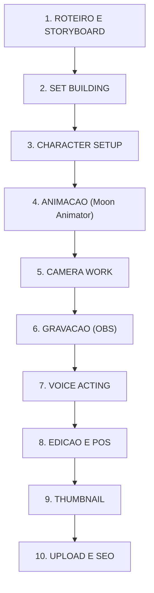
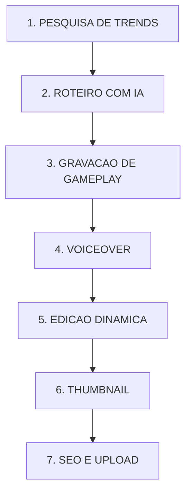

# 🔬 DEEP DIVE: @ShanePlaysRBX + Vídeo Victor Santos (Canal Dark Roblox)

## Resumo Executivo

> **Dois modelos de produção completamente diferentes, ambos extremamente lucrativos no nicho Roblox.** ShanePlaysRBX (5.25M subs) opera como um **mini-estúdio de cinema Roblox** com produção cinematográfica usando Moon Animator, sets customizados e edição profissional. O vídeo de Victor Santos (o9dlWlkQ8U4) ensina o modelo de **"Canal Dark"** — canais faceless que usam IA + CapCut para escalar produção rapidamente. Para o THIAGERA, ambos oferecem lições estratégicas valiosas, mas nenhum usa AI video generation. **A oportunidade está em combinar a qualidade narrativa de ShanePlays com o poder visual da AI generation do THIAGERA.**

---

## PARTE 1: 📺 ANÁLISE DO CANAL @ShanePlaysRBX

### 1.1 Overview do Canal

| Métrica | Dados |
|:---|:---|
| **Nome** | ShanePlays |
| **Handle** | @ShanePlaysRBX |
| **URL** | https://www.youtube.com/@ShanePlaysRBX |
| **Subscribers** | **~5.25 milhões** (Mai 2026) |
| **Views totais** | **845+ milhões** |
| **Canal secundário** | ShanePlays 2 (~5M subs) |
| **Engajamento** | ~3.31% (classificado como "Bom") |
| **Crescimento** | +20K subs/mês (estável) |
| **País** | Estados Unidos 🇺🇸 |
| **Idioma** | Inglês (EN) |
| **Tipo de conteúdo** | Roblox Movies / Cinematic Roleplay |
| **Público-alvo** | Crianças e adolescentes (8-16 anos) |
| **Frequência** | 2-4 vídeos/semana |

### 1.2 Estilo de Conteúdo

ShanePlays se diferencia de outros canais Roblox por criar **"Roblox Movies"** — vídeos narrativos cinematográficos com:
- Histórias dramáticas/humorísticas ("The Richest Twins In Roblox", "Abandoned By Superhero Parents")
- Referências a cultura pop (Squid Game, Spiderman, personagens trending)
- Produção visual acima da média com **cinematografia cuidadosa**
- Storytelling serializado com arcos narrativos

> [!IMPORTANT]
> ShanePlays **NÃO usa AI video generation**. Todo conteúdo visual é produzido dentro do **Roblox Studio** com plugins de animação profissional.

---

### 1.3 Análise Técnica de Produção

#### Engine Visual: Roblox Studio + Moon Animator

| Componente | Ferramenta | Função |
|:---|:---|:---|
| **Motor 3D** | Roblox Studio | Construção de sets, iluminação, ambiente |
| **Animação** | Moon Animator 2 | Animação de personagens, câmera, expressões faciais |
| **Expressões** | HDify + Face Packs | Animação de olhos e boca para diálogo |
| **Câmera** | Moon Animator Camera Track | FOV baixo (~35), movimentos suaves, cinematográfico |
| **Áudio in-engine** | Lunar Sound Plugin | Sincronização de SFX com animação |
| **Rigs** | R6/R15 Custom | Personagens com roupas e aparência customizada |

#### Workflow de Filmagem

#### Software Completo Identificado

| Fase | Ferramenta | Custo |
|:---|:---|:---|
| Roteiro | ChatGPT + criatividade manual | $0-20/mês |
| Cenários | Roblox Studio | Grátis |
| Animação | Moon Animator 2 (plugin) | Grátis (Roblox) |
| Expressões | HDify + Face Packs | Grátis |
| Gravação | OBS Studio | Grátis |
| Edição | Adobe Premiere Pro ou DaVinci Resolve | $0-23/mês |
| Áudio | Vozes humanas + SFX library | Variável |
| Thumbnails | Adobe Photoshop ou Canva | $0-12/mês |
| SEO | VidIQ ou TubeBuddy | $0-50/mês |
| **TOTAL** | | **$0-105/mês** |

### 1.4 Produção de Áudio

| Aspecto | Detalhes |
|:---|:---|
| **Vozes** | Mix de vozes humanas + possível AI TTS em alguns vídeos |
| **Estilo** | Narração dramática, diálogos entre personagens |
| **SFX** | Extenso — efeitos de ação, ambiente, humor |
| **Música** | BGM stock + trilhas temáticas por cena |
| **Lip-sync** | Parcial — animação de boca via Face Packs no Moon Animator |
| **Sound Design** | Acima da média para Roblox — timing cuidadoso |

### 1.5 Consistência de Personagem

| Método | Implementação |
|:---|:---|
| **Catalog Items salvos** | Cada personagem tem outfit fixo no Roblox |
| **Face Packs** | Expressões faciais consistentes entre episódios |
| **Sets reutilizáveis** | Mesmos ambientes retornam entre episódios |
| **Character Bible** | Identidade visual de personagens recorrentes |
| **Nível** | Perfeito — determinístico, sem variação |

### 1.6 Estratégia de YouTube

| Tática | Implementação |
|:---|:---|
| **Títulos** | Clickbait emocional: "Abandoned By...", "The Richest...", "Adopted By..." |
| **Thumbnails** | Personagens Roblox em situações dramáticas, cores vibrantes, expressões exageradas |
| **SEO** | Keywords de cultura pop + Roblox |
| **Frequência** | 2-4x/semana (alta produtividade) |
| **Shorts** | Clips de momentos dramáticos/engraçados dos vídeos longos |
| **Hook** | Primeira cena SEMPRE com conflito ou mistério |
| **Retenção** | Pacing rápido, cortes frequentes, SFX de impacto |

---

## PARTE 2: 🎬 DEEP DIVE NO VÍDEO ESPECÍFICO

### 2.1 Metadados

| Campo | Dados |
|:---|:---|
| **URL** | https://www.youtube.com/watch?v=o9dlWlkQ8U4 |
| **Título** | "Roblox Rants: The RIGHT Way to Create and Grow Your Channel (Complete Guide)" |
| **Canal** | **Victor Santos** |
| **Tipo** | Tutorial / Guia de Negócio |
| **Tema** | Como criar e crescer **canais dark** (faceless) de Roblox no YouTube |
| **Idioma** | Português (PT-BR) |
| **Público** | Aspirantes a criadores de conteúdo |

### 2.2 O Que É Um "Canal Dark"?

Um **canal dark** (ou canal escuro) é um canal do YouTube onde o criador:
- Não aparece no vídeo
- Não mostra o rosto
- Usa gameplay gravado + narração (humana ou AI)
- Pode escalar produção com automação
- Foco em volume e consistência

### 2.3 Modelo de Produção Ensinado por Victor Santos

#### Pipeline do Canal Dark Roblox

#### Stack de Ferramentas (Canal Dark)

| Tarefa | Ferramenta | Custo |
|:---|:---|:---|
| **Ideação/Roteiro** | ChatGPT, Syllaby | $0-20/mês |
| **Voiceover** | ElevenLabs, DupDub, Murf AI | $0-30/mês |
| **Edição** | CapCut (PC), InVideo, Veed.io | $0-8/mês |
| **Gameplay** | OBS Studio + Roblox | Grátis |
| **Thumbnails** | Canva | $0-12/mês |
| **SEO** | VidIQ | $0-50/mês |
| **TOTAL** | | **$0-120/mês** |

### 2.4 Diferenciais do Modelo Canal Dark

| Aspecto | Detalhes |
|:---|:---|
| **Escalabilidade** | 1 pessoa pode produzir 1-2 vídeos/dia |
| **Custo ultra-baixo** | Menos de $120/mês com ferramentas pagas |
| **Sem exposição pessoal** | Não precisa de câmera, estúdio, nem aparecer |
| **Replicável** | Processo sistematizado, fácil de terceirizar |
| **Qualidade limitada** | Gameplay genérico, narração AI pode soar robótica |
| **Risco de AI slop** | YouTube penaliza conteúdo gerado em massa sem valor |
| **Sem identidade forte** | Difícil criar conexão emocional sem personalidade do criador |

---

## PARTE 3: 📊 TABELA COMPARATIVA

### ShanePlays vs Victor Santos (Canal Dark) vs THIAGERA

| Critério | ShanePlays | Canal Dark (Victor Santos) | THIAGERA (Projetado) | VENCEDOR |
|:---|:---|:---|:---|:---|
| **Custo/mês** | $0-105 | $0-120 | $630-1900 | Canal Dark |
| **Qualidade visual** | Alta (Roblox cinema) | Baixa (gameplay cru) | Muito Alta (AI gen) | THIAGERA |
| **Originalidade** | Alta (Moon Animator) | Baixa (gameplay genérico) | Muito Alta (mundos únicos) | THIAGERA |
| **Velocidade de produção** | Lenta (4-8h/vídeo) | Rápida (1-2h/vídeo) | Média (2-4h/vídeo) | Canal Dark |
| **Escalabilidade** | Baixa (manual) | Alta (sistematizado) | Alta (automatizável) | Empate |
| **Consistência de personagem** | Perfeita (determinístico) | N/A (gameplay) | Desafiante (AI) | ShanePlays |
| **Voice acting** | Misto (humano+AI) | AI (ElevenLabs) | AI (ElevenLabs) | ShanePlays |
| **Sound design** | Bom | Básico | Avançado (Stable Audio) | THIAGERA |
| **Lip-sync** | Parcial (Face Packs) | Inexistente | Possível (Higgsfield) | THIAGERA |
| **Storytelling** | Excelente | Fraco | A definir | ShanePlays |
| **SEO/Packaging** | Excelente | Bom | A definir | ShanePlays |
| **Subscribers** | 5.25M + 5M | Canal pequeno | 0 (canal novo) | ShanePlays |
| **Mercado** | EN (EUA) | PT-BR (Brasil) | PT-BR (Brasil) | Empate |
| **Risco AI slop** | Zero | Alto | Médio | ShanePlays |

---

## PARTE 4: 🎯 ENGENHARIA REVERSA PARA THIAGERA

### 4.1 Lições do ShanePlays (O Que Copiar)

#### Cinematografia com Intenção
ShanePlays trata cada vídeo como um **curta-metragem**, não como gameplay. Isso inclui:
- FOV baixo para look cinematográfico
- Regra dos terços na composição
- Movimentos de câmera suaves e deliberados
- Letterboxing (barras pretas) para efeito de filme

**Ação THIAGERA:**
- [ ] Aplicar princípios cinematográficos nos prompts de AI video generation
- [ ] Usar camera control dos modelos (Runway Director Mode, Kling camera presets)
- [ ] Adicionar letterboxing em pós-produção para look premium

#### Storytelling com Hooks Emocionais
Os títulos e histórias de ShanePlays exploram emoções universais: abandono, riqueza, superherois, família.

**Ação THIAGERA:**
- [ ] Criar roteiros com conflitos emocionais claros desde o primeiro segundo
- [ ] Usar temas universais adaptados para público PT-BR
- [ ] Testar temas: "A Criança Mais Rica do Brasil", "Abandonado Pelos Pais Superherois"

#### Thumbnails Profissionais
As thumbnails de ShanePlays são tratadas como **posters de filme** — expressões exageradas, cores vibrantes, composição dramática.

**Ação THIAGERA:**
- [ ] Gerar thumbnails com Flux Dev (personagens AI em poses dramáticas)
- [ ] Aplicar estilo "poster de filme animado" (não screenshot)
- [ ] Expressões faciais exageradas para CTR alto

### 4.2 Lições do Victor Santos / Canal Dark (O Que Adaptar)

#### Velocidade de Produção
O modelo canal dark mostra que é possível produzir 1-2 vídeos/dia com automação.

**Ação THIAGERA:**
- [ ] Automatizar pipeline com OpenMontage para batch processing
- [ ] Criar templates de roteiro no ChatGPT para acelerar scripting
- [ ] Batch-process: 1 dia de pesquisa, 1 dia de geração, 1 dia de edição

#### IA Como Motor de Produção
Victor Santos mostra que ElevenLabs + CapCut + ChatGPT são suficientes para criar conteúdo monetizável.

**Ação THIAGERA:**
- [ ] ElevenLabs v3 para vozes de personagem (já na stack)
- [ ] ChatGPT/Claude para roteirização (já em uso)
- [ ] Remotion maior que CapCut para composição programática (vantagem de automação)

#### Micro-Nichos Trending
O conceito de identificar micro-nichos dentro de Roblox/gaming é aplicável para animação AI.

**Ação THIAGERA:**
- [ ] Pesquisar trending topics infantis no Brasil semanalmente
- [ ] Criar conteúdo rápido (Shorts) sobre temas virais
- [ ] Monitorar o que está viralizando no TikTok/Kwai BR

### 4.3 Onde THIAGERA Supera AMBOS

| Gap | THIAGERA Advantage |
|:---|:---|
| **Visual** | AI generation muito superior ao Roblox engine (visuais nível Pixar) |
| **Mundos únicos** | Cada cena pode ter um mundo completamente original |
| **Lip-sync real** | Higgsfield/SadTalker supera Face Packs do Roblox |
| **Trilha original** | Stable Audio 3.0 supera stock music |
| **Automação end-to-end** | Pipeline programático supera edição manual |
| **Mercado PT-BR** | Nenhum concorrente com este nível de qualidade visual em PT-BR |

### 4.4 Estimativa de Custo Comparativo (1 vídeo de 10 min)

| Aspecto | ShanePlays | Canal Dark | THIAGERA |
|:---|:---|:---|:---|
| Roteiro | $0 (manual) | $0-2 (ChatGPT) | $0-2 (ChatGPT) |
| Visuais | $0 (Roblox grátis) | $0 (gameplay grátis) | $50-150 (APIs AI) |
| Vozes | $0 (própria voz) | $5-15 (ElevenLabs) | $5-15 (ElevenLabs) |
| Música/SFX | $0-5 (stock) | $0-5 (stock) | $5-15 (Stable Audio) |
| Edição | $0-5 (software) | $0-2 (CapCut) | $0 (Remotion) |
| Thumbnail | $0-2 | $0-2 | $0-3 (Flux) |
| **TOTAL/vídeo** | **$0-12** | **$5-26** | **$60-185** |
| **Tempo/vídeo** | 4-8 horas | 1-2 horas | 2-4 horas |

---

## PARTE 5: 🚀 PLANO DE AÇÃO CONCRETO

### Fase 1: Fundação Narrativa (Semanas 1-2)
- [ ] **PRIORIDADE ALTA** — Estudar os 10 vídeos mais populares do ShanePlays e extrair padrões de storytelling
- [ ] **PRIORIDADE ALTA** — Criar "THIAGERA Universe" com 3-5 personagens principais (character sheets completos)
- [ ] **PRIORIDADE ALTA** — Definir 3 "fórmulas narrativas" (riqueza/aventura, família/emoção, ação/superherois)
- [ ] **PRIORIDADE MÉDIA** — Configurar voice profiles distintos no ElevenLabs para cada personagem

### Fase 2: Produção Piloto (Semanas 3-4)
- [ ] **PRIORIDADE ALTA** — Produzir 3 episódios piloto com os seguintes specs:
  - 7-10 minutos cada
  - Kling 3.0 Subject Binding para consistência
  - ElevenLabs v3 para vozes
  - Remotion para composição
- [ ] **PRIORIDADE ALTA** — Criar thumbnails estilo "poster de filme animado"
- [ ] **PRIORIDADE MÉDIA** — Aplicar SEO: títulos emocionais ALL CAPS + keywords PT-BR

### Fase 3: Modelo Híbrido (Semanas 5-8)
- [ ] **PRIORIDADE ALTA** — Combinar modelos: qualidade ShanePlays + velocidade Canal Dark
  - Long-form (2x/semana): produção curada, alta qualidade
  - Shorts (diários): produção rápida, trending topics
- [ ] **PRIORIDADE MÉDIA** — Implementar batch processing no pipeline
- [ ] **PRIORIDADE MÉDIA** — Começar a fazer behind-the-scenes do processo de criação com AI

### Fase 4: Crescimento (Semanas 9-16)
- [ ] **PRIORIDADE ALTA** — Analisar métricas e iterar (retenção, CTR, watch time)
- [ ] **PRIORIDADE ALTA** — Escalar para 3-4 vídeos longos/semana se pipeline funcionar
- [ ] **PRIORIDADE MÉDIA** — Community engagement ativo
- [ ] **PRIORIDADE BAIXA** — Testar conteúdo bilíngue (PT-BR + legendas EN) para alcance global

---

## PARTE 6: ALERTAS CRÍTICOS

> [!CAUTION]
> **Risco de "AI Slop"**: O modelo Canal Dark de Victor Santos demonstra como conteúdo de baixa qualidade pode ser produzido em massa. O YouTube está combatendo ativamente este tipo de conteúdo em 2026. O THIAGERA DEVE se posicionar como conteúdo premium, NAO como canal dark automatizado.

> [!WARNING]
> **Consistência de Personagem**: Este é o MAIOR desafio técnico do THIAGERA. ShanePlays tem consistência perfeita porque usa avatares Roblox determinísticos. Com AI generation, precisamos investir pesado em Subject Binding (Kling 3.0), SOUL ID (Higgsfield), ou LoRA customizados.

> [!TIP]
> **Oportunidade Unica**: No mercado PT-BR, não existe nenhum canal que combine a qualidade narrativa de ShanePlays com a qualidade visual de AI generation. O THIAGERA pode ser o PRIMEIRO a preencher este gap.

---

## Fontes e Links

- [Canal ShanePlaysRBX](https://www.youtube.com/@ShanePlaysRBX)
- [Vídeo Victor Santos](https://www.youtube.com/watch?v=o9dlWlkQ8U4)
- [HypeAuditor - ShanePlays Analytics](https://hypeauditor.com)
- [VidIQ - ShanePlays Stats](https://vidiq.com)
- [Moon Animator 2 - Roblox Plugin](https://www.roblox.com/library/4725618216/Moon-Animator-2)
- Pesquisas realizadas via Google Search (Mai 2026)

---

## CONCLUSAO

> **Dois modelos distintos, uma lição unificada:** O sucesso no YouTube não depende só de ferramentas — depende de **storytelling + consistência + packaging**. ShanePlays prova que qualidade cinematográfica (mesmo dentro do Roblox) gera milhões. Victor Santos prova que velocidade + trending topics gera monetização rápida.
>
> **O THIAGERA deve ser a síntese desses dois modelos**: a qualidade visual incomparável da AI generation, combinada com storytelling emocional serializado (como ShanePlays) e velocidade de produção automatizada (como Canal Dark). Tudo isso em um mercado PT-BR que está **faminto** por este tipo de conteúdo.
>
> **Veredicto: Nenhum dos dois canais é concorrente direto do THIAGERA.** Mas ambos são **modelos de estratégia** que devemos estudar e superar com tecnologia AI.
